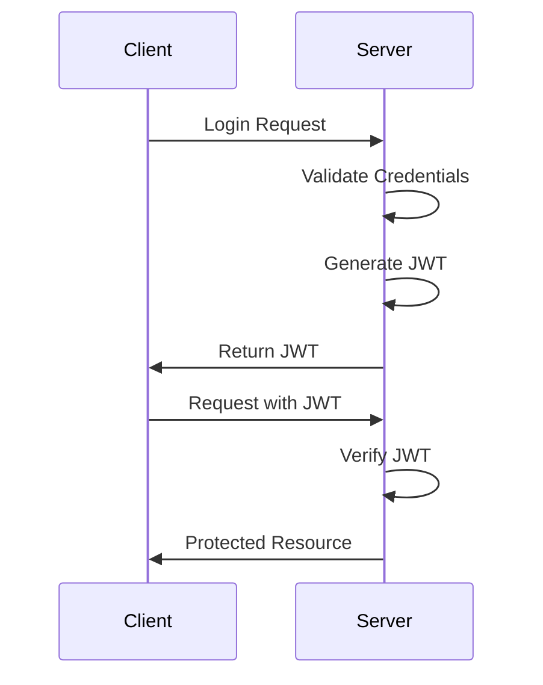

# 📚 Buổi 13: Authentication với JWT và Guards (NestJS)

## ❓ Câu hỏi mở đầu
- Làm sao để bảo vệ API khỏi truy cập trái phép?
- JWT là gì, tại sao nên dùng thay vì session?
- Guards trong NestJS giúp ích gì cho việc bảo mật?

Have you ever wondered:
- How to protect APIs from unauthorized access?
- What is JWT and why use it instead of sessions?
- How do Guards help with security in NestJS?

---

## 1. 🔐 Authentication là gì?

### 1.1. Khái niệm cơ bản
- **Authentication**: Xác thực danh tính người dùng
- **Authorization**: Phân quyền truy cập tài nguyên
- **JWT (JSON Web Token)**: Token chứa thông tin người dùng được mã hóa

### 1.2. Flow Authentication cơ bản


---

## 2. 🎫 JWT trong NestJS

### 2.1. Cài đặt dependencies
```bash
pnpm add @nestjs/jwt @nestjs/passport passport passport-jwt
pnpm add -D @types/passport-jwt
```

### 2.2. Cấu hình JWT Module
```typescript
// auth.module.ts
import { Module } from '@nestjs/common';
import { JwtModule } from '@nestjs/jwt';
import { PassportModule } from '@nestjs/passport';

@Module({
  imports: [
    PassportModule,
    JwtModule.register({
      secret: process.env.JWT_SECRET,
      signOptions: { expiresIn: '1d' },
    }),
    UsersModule,
  ],
  providers: [AuthService, JwtStrategy],
  exports: [AuthService],
})
export class AuthModule {}
```

### 2.3. Auth Service
```typescript
// auth.service.ts
import { Injectable, UnauthorizedException } from '@nestjs/common';
import { JwtService } from '@nestjs/jwt';
import { UsersService } from '../users/users.service';

@Injectable()
export class AuthService {
  constructor(
    private usersService: UsersService,
    private jwtService: JwtService,
  ) {}

  async validateUser(email: string, password: string) {
    const user = await this.usersService.findByEmail(email);
    if (user && await bcrypt.compare(password, user.password)) {
      const { password, ...result } = user;
      return result;
    }
    return null;
  }

  async login(user: User) {
    const payload = { email: user.email, sub: user.id, role: user.role };
    return {
      access_token: this.jwtService.sign(payload),
      user: {
        id: user.id,
        email: user.email,
        role: user.role,
      },
    };
  }
}
```

### 2.4. JWT Strategy
```typescript
// jwt.strategy.ts
import { ExtractJwt, Strategy } from 'passport-jwt';
import { PassportStrategy } from '@nestjs/passport';
import { Injectable, UnauthorizedException } from '@nestjs/common';

@Injectable()
export class JwtStrategy extends PassportStrategy(Strategy) {
  constructor(private usersService: UsersService) {
    super({
      jwtFromRequest: ExtractJwt.fromAuthHeaderAsBearerToken(),
      ignoreExpiration: false,
      secretOrKey: process.env.JWT_SECRET,
    });
  }

  async validate(payload: Payload) {
    const user = await this.usersService.findOne(payload.sub);
    if (!user) {
      throw new UnauthorizedException();
    }
    return { userId: payload.sub, email: payload.email, role: payload.role };
  }
}
```

---

## 3. 🛡️ Guards trong NestJS

### 3.1. Auth Guard
```typescript
// auth.guard.ts
import { Injectable, CanActivate, ExecutionContext } from '@nestjs/common';
import { Reflector } from '@nestjs/core';

@Injectable()
export class AuthGuard implements CanActivate {
  constructor(private reflector: Reflector) {}

  canActivate(context: ExecutionContext) {
    const isPublic = this.reflector.get<boolean>(
      'isPublic',
      context.getHandler(),
    );
    if (isPublic) return true;

    const request = context.switchToHttp().getRequest();
    return request.user;
  }
}
```

### 3.2. Roles Guard
```typescript
// roles.guard.ts
import { Injectable, CanActivate, ExecutionContext } from '@nestjs/common';
import { Reflector } from '@nestjs/core';

@Injectable()
export class RolesGuard implements CanActivate {
  constructor(private reflector: Reflector) {}

  canActivate(context: ExecutionContext): boolean {
    const requiredRoles = this.reflector.get<string[]>(
      'roles',
      context.getHandler(),
    );
    if (!requiredRoles) return true;

    const { user } = context.switchToHttp().getRequest();
    return requiredRoles.some((role) => user.role === role);
  }
}
```

### 3.3. Sử dụng Guards
```typescript
// tasks.controller.ts
@Controller('tasks')
@UseGuards(AuthGuard, RolesGuard)
export class TasksController {
  @Get()
  @Roles('admin', 'user')
  findAll(@Query() query: GetAllTasksDto) {
    return this.tasksService.findAll(query);
  }

  @Post()
  @Roles('admin')
  create(@Body() dto: CreateTaskDto) {
    return this.tasksService.create(dto);
  }
}
```

---

## 4. 🔄 Refresh Token Flow

### 4.1. Cấu trúc Refresh Token
```typescript
// auth.service.ts
@Injectable()
export class AuthService {
  async generateTokens(user: User) {
    const [accessToken, refreshToken] = await Promise.all([
      this.jwtService.signAsync(
        { sub: user.id, email: user.email, role: user.role },
        { expiresIn: '15m' }
      ),
      this.jwtService.signAsync(
        { sub: user.id },
        { expiresIn: '7d' }
      ),
    ]);

    await this.tokenService.saveRefreshToken(user.id, refreshToken);

    return {
      access_token: accessToken,
      refresh_token: refreshToken,
    };
  }

  async refreshTokens(refreshToken: string) {
    try {
      const { sub } = await this.jwtService.verifyAsync(refreshToken);
      const isValid = await this.tokenService.validateRefreshToken(sub, refreshToken);
      
      if (!isValid) {
        throw new UnauthorizedException('Invalid refresh token');
      }

      const user = await this.usersService.findOne(sub);
      return this.generateTokens(user);
    } catch {
      throw new UnauthorizedException('Invalid refresh token');
    }
  }
}
```

### 4.2. Token Service
```typescript
// token.service.ts
@Injectable()
export class TokenService {
  constructor(
    @InjectRepository(RefreshToken)
    private tokenRepository: Repository<RefreshToken>,
  ) {}

  async saveRefreshToken(userId: number, token: string) {
    const refreshToken = this.tokenRepository.create({
      userId,
      token,
      expiresAt: new Date(Date.now() + 7 * 24 * 60 * 60 * 1000),
    });
    return this.tokenRepository.save(refreshToken);
  }

  async validateRefreshToken(userId: number, token: string) {
    const refreshToken = await this.tokenRepository.findOne({
      where: { userId, token, revoked: false },
    });
    return !!refreshToken;
  }
}
```

---

## 5. 🔒 Security Best Practices

### 5.1. Token Security
- Sử dụng strong secret key
- Đặt thời gian hết hạn ngắn cho access token
- Lưu refresh token an toàn (HttpOnly cookie)
- Implement token blacklist/revocation

### 5.2. Password Security
```typescript
// auth.service.ts
@Injectable()
export class AuthService {
  async hashPassword(password: string): Promise<string> {
    const saltRounds = 10;
    return bcrypt.hash(password, saltRounds);
  }

  async validatePassword(plainText: string, hashed: string): Promise<boolean> {
    return bcrypt.compare(plainText, hashed);
  }
}
```

### 5.3. Rate Limiting
```typescript
// main.ts
import { ThrottlerModule } from '@nestjs/throttler';

@Module({
  imports: [
    ThrottlerModule.forRoot([{
      ttl: 60,
      limit: 5,
    }]),
  ],
})
export class AppModule {}
```

---

## 💡 Best Practices khi implement Authentication

### 1. Token Management
- Sử dụng short-lived access tokens
- Implement refresh token rotation
- Có cơ chế revoke token
- Log token usage

### 2. Error Handling
- Custom exception cho auth errors
- Không expose sensitive info trong error
- Log security events
- Rate limit failed attempts

### 3. Security Headers
```typescript
// main.ts
app.use(helmet());
app.enableCors({
  origin: process.env.ALLOWED_ORIGINS.split(','),
  credentials: true,
});
```

### 4. Testing
- Unit test cho auth logic
- E2E test cho auth flow
- Test security scenarios
- Mock external services

---

## ✅ Checklist review Authentication
- [ ] JWT được cấu hình đúng (secret, expiration)
- [ ] Refresh token flow hoạt động
- [ ] Guards bảo vệ routes đúng cách
- [ ] Password được hash an toàn
- [ ] Có rate limiting cho auth endpoints
- [ ] Error handling rõ ràng
- [ ] Security headers được set
- [ ] Có logging cho security events

---

## 📝 Bài tập thực hành
1. Implement JWT Authentication:
   - Login endpoint
   - Protected routes
   - Refresh token flow

2. Role-based Authorization:
   - User roles (admin, user)
   - Role guards
   - Protected resources

3. Security Features:
   - Rate limiting
   - Password hashing
   - Token blacklist
   - Security headers

---

## 🔗 Tham khảo / References
- [NestJS Authentication](https://docs.nestjs.com/security/authentication)
- [JWT Best Practices](https://auth0.com/blog/jwt-security-best-practices/)
- [Passport.js Documentation](http://www.passportjs.org/)
- [NestJS Guards](https://docs.nestjs.com/guards)
